# ON LARGE LANGUAGE MODEL CONTINUAL

# UNLEARNING

Chongyang Gao1∗†, Lixu Wang1∗†, Kaize Ding1, Chenkai Weng2, Xiao Wang1, Qi Zhu1

1Northwestern University, 2Arizona State University {cygao, lixuwang2025}@u.northwestern.edu, chenkai.weng@asu.edu {kaize.ding,wangxiao,qzhu}@northwestern.edu

## ABSTRACT

While large language models have demonstrated impressive performance across various domains and tasks, their security issues have become increasingly severe. Machine unlearning has emerged as a representative approach for model safety and security by removing the influence of undesired data on the target model. However, these methods do not sufficiently consider that unlearning requests in real-world scenarios are continuously emerging, especially in the context of LLMs, which may lead to accumulated model utility loss that eventually becomes unacceptable. Moreover, existing LLM unlearning methods often ignore previous data access limitations due to privacy concerns and copyright protection. Without previous data, the utility preservation during unlearning is much harder. To overcome these challenges, we propose the O3 framework that includes an Orthogonal low-rank adapter (LoRA) for continually unlearning requested data and an Out- Of-Distribution (OOD) detector to measure the similarity between input and unlearning data. The orthogonal LoRA achieves parameter disentanglement among continual unlearning requests. The OOD detector is trained with a novel contrastive entropy loss and utilizes a glocal-aware scoring mechanism. During inference, our O3 framework can decide whether and to what extent to load the unlearning LoRA based on the OOD detector’s predicted similarity between the input and the unlearned knowledge. Notably, O3’s effectiveness does not rely on any retained data. We conducted extensive experiments on O3 and state-of-the-art LLM unlearning methods across three tasks and seven datasets. The results indicate that O3 consistently achieves the best unlearning effectiveness and utility preservation, especially when facing continuous unlearning requests. The source codes can be found at https://github.com/GCYZSL/O3-LLM-UNLEARNING.

1

## INTRODUCTION

Recently, bolstered by scaling laws (Kaplan et al., 2020), the size of language models has grown tremendously, demonstrating excellent performance across various tasks (Wang et al., 2024). However, concerns about large language models (LLMs) have also increased, particularly regarding how to eliminate undesirable data influence (e.g., privacy information (Pan et al., 2020)). To address this issue, machine unlearning (Bourtoule et al., 2021) is applied in LLMs to remove private, toxic, or illegal data. Current methods for LLM unlearning can be primarily categorized into parameter optimization (Chen & Yang, 2023; Eldan & Russinovich, 2023; Jia et al., 2024; Zhang et al., 2024; Meng et al., 2022; Li et al., 2024), and in-context unlearning (Thaker et al., 2024; Pawelczyk et al., 2024). The parameter optimization methods involve directly fine-tuning the LLM, with the objective typically being to maximize the task loss on the unlearning data or to minimize the random label loss. Some methods identify the related parameters and then make appropriate modifications. Incontext learning-based methods modify the LLM input prompts to make the LLM refuse to output content related to the unlearning data. Regarding unlearning effectiveness, parameter optimization is typically much more effective than in-context learning.

However, these methods still often poorly maintain the model utility outside the unlearned knowledge, especially in real-world continual settings. The challenges are two-fold: (i): First, in addition

*Equal contributions (ordered alphabetically); †Corresponding author.

to the data that needs to be unlearned, existing unlearning methods also require a large dataset called the retained dataset to maintain the model utility. This retained dataset often consists of the original training dataset (Bourtoule et al., 2021) or a portion of it, but as LLMs are trained on massive datasets (Wang et al., 2024), assuming access to the complete training data is typically unrealistic (Liu et al., 2024). Moreover, as time goes on, the original training data of LLMs may become inaccessible due to expired access authorization, data privacy, and intellectual property protection (Sun et al., 2024). If the retained dataset only contains incomplete training data distribution, the model utility of the missing parts significantly declines after unlearning. Although some studies shrink the range of the retained data to the distribution most susceptible to unlearning, this distribution itself is hard to characterize and its data may be limited due to intrinsic rarity and privacy protection (Chang et al., 2024; Huang et al., 2024). (ii): The second challenge is that existing LLM unlearning methods only consider single operations and cannot perform effective continual unlearning. LLM unlearning is often not a one-off operation but a continual process, as unlearning requests continuously emerge in the real world (Liu et al., 2024). As the number of unlearning operations increases, the aforementioned decline in model utility will also have a cumulative effect, even with the retained dataset, meaning that the model’s general capabilities will significantly decrease Gu et al. (2024); Gupta et al. (2024) over time.

In this work, to achieve more effective continual unlearning for LLMs, we propose the O3 framework, which can balance unlearning effectiveness and model utility preservation in continuous scenarios without using any retained data. At a high level, the O3 framework mainly includes an Orthogonal Low-rank adapter (LoRA) (Hu et al., 2021) for continuously unlearning requested data and an Out-Of-Distribution (OOD) detection module to assess the similarity between input data and unlearning data. Specifically, the orthogonal LoRA in O3 enables the disentanglement of parameter space across different unlearning requests, ensuring that the unlearning effectiveness of different requests does not interfere with each other. Then the OOD detector in O3 is trained with a novel contrastive entropy loss as its backbone and supplemented with a glocal-aware scoring mechanism. The O3 framework can balance unlearning and utility because it smartly leverages the data similarity determined by the OOD detector to decide whether and to what extent to load the unlearning LoRA during inference. In summary, the main contributions of this work include:

- We study the underexplored problem of LLM continual unlearning and tackle the challenge of

balancing unlearning effectiveness and model utility preservation when LLM faces the continuous arrival of unlearning requests, without using any retained data.

- We propose a novel O3 framework that includes an orthogonal unlearning LoRA and an OOD de-

tector. The orthogonal design of LoRA prevents interference among different unlearning requests, achieving better unlearning effectiveness in continuous scenarios. The OOD detector measures the similarity between input and unlearning data, allowing O3 to decide whether and to what extent to load the unlearning LoRA during inference.

- We conduct extensive experiments on multiple benchmark tasks that comprehensively test the

LLM continual unlearning on discriminative, generative, and reasoning tasks. The experiment results demonstrate that O3 consistently achieves the best balance between unlearning effectiveness and utility preservation without using any retained data, compared with many state-of-the-art baseline methods when facing continuous unlearning requests.

2

## PRELIMINARY

Language Model Unlearning. Machine unlearning (Bourtoule et al., 2021) is proposed to protect data privacy and ensure authorized usage (Liu et al., 2024; Zhang et al., 2023). There have been approaches to achieving unlearning through parameter optimization (Jang et al., 2023; Golatkar et al., 2020; Yao et al., 2023; Eldan & Russinovich, 2023; Zhang et al., 2024; Jia et al., 2024; Meng et al., 2022; Yu et al., 2023; Wu et al., 2023; Li et al., 2024), and in-context learning (Thaker et al., 2024; Pawelczyk et al., 2024). The optimization-based unlearning is to employ GradAsc (Golatkar et al., 2020; Yao et al., 2023) on the unlearned data. The following approaches, like PO (Eldan & Russinovich, 2023; Zhang et al., 2024; Jia et al., 2024), notice that unconstrained GradAsc hurts the model’s utility, thus crafting task labels through shuffling or rejection. Yu et al. (2023) localizes the model parameters related to unlearning data and updates them through merging or subtracting (Ding et al., 2023). The in-context learning-based methods adjust input prompts to reject unwanted content generation. Although these approaches can achieve unlearning in certain cases, they neglect that

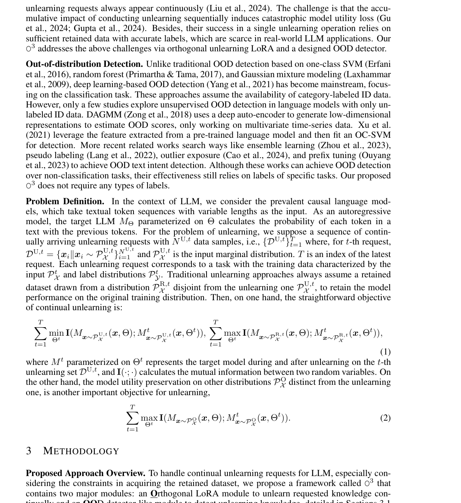

tinually and an OOD detector-like module to detect unlearning knowledge, detailed in Sections 3.1 and 3.2, respectively. O3 continuously unlearns the requested data using LoRA with an orthogonal regularization loss that can maintain continuous unlearning performance. O3 obtains the unlearning knowledge detection module by the contrastive entropy minimization and local-global layeraggregated scoring techniques, which can predict the probability that the input data sample belongs to the unlearning distribution PU,t X . These two major modules only use the unlearning dataset of each unlearning request and do not require the access of retained data. After unlearning, O3 works with an effective inference mechanism (Section 3.3), in which the unlearning LoRA is loaded with soft weights originating from the probability predicted by the OOD module to produce distinct outputs for different data.

Continual

Unlearning

Unlearn The Lord of the Rings

Unseen Data Related to The Lord of the Rings

Unlearning

...

Request

Requests

t

OOD Score

Ramdom Label

Mark Twain

Huckleberry Finn

LCEL l dCos + dMaha

Bj t Bj t

Bj t

Encoder

B B

## OCSVM

Aj t

Aj t

A A

Who is the writer of The Lord of the Rings?

Who is the main character in The Lord of the Rings?

Training Pipeline

Soft-weighted Inference

Figure 1: The overview of O3 framework to handle continual unlearning requests for LLM without using any retained data. O3 includes two major components: an Orthogonal optimization process for unlearning requested knowledge, and an OOD detector is used to detect whether the input contains the unlearning knowledge. The unlearning knowledge optimization uses the orthogonal loss (LOrth) to prevent interference among different unlearning requests. The OOD detector is trained by a novel contrastive entropy loss (LCEL) and works with a layer-aggregated scoring mechanism that leverages cosine similarity (dCos) and Mahalanobis distance (dMaha). In the inference phase, the OOD detector decides whether and to what extent to load the unlearning LoRA.

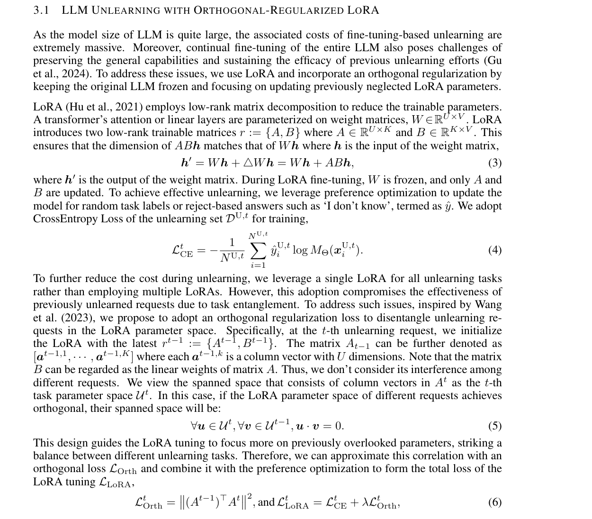

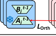

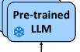

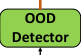

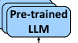

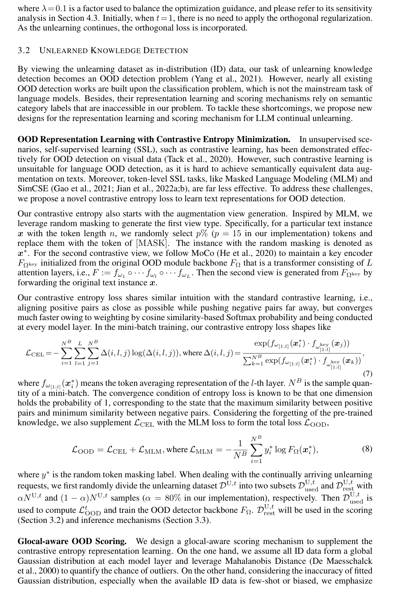

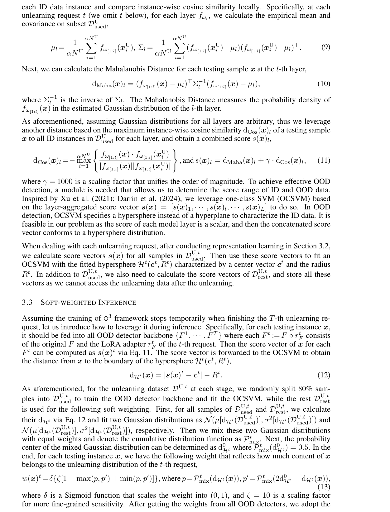

maximum weight w(x) = max{w(x)1, · · · , w(x)T } to load the unlearning LoRA by modifying Eq. 3 into h′ = Wh+w(x)·ABh. In this case, the input x is sequentially forwarded to all attention layers of the target LLM to obtain the final inference results. A higher w(x) implies that x is close to at least one unlearning distribution, thus we should load the unlearning LoRA. In contrast, if w(x) is relatively low, detaching the LoRA while using the original model makes more sense. The algorithm pipeline is provided in Appendix D.

4

## EXPERIMENTS

4.1

## EXPERIMENTAL SETUPS

Datasets. In the main context, we conduct experiments on three tasks: Question Answering, Fictitious Knowledge Generation, and Intent Classification by unlearning different types of subsets continuously while maintaining the utility ability. Appendix E.2 provides more details.

- Question Answering. For ScienceQA (Lu et al., 2022b), we gather text-only samples to form

a train and test set with 6,508 and 2,224 samples. We choose four domains in ScienceQA as continual unlearning requests, i.e., biology →physics →chemistry →economics. We use CommonsenseQA (Talmor et al., 2019) as a utility dataset, which contains 9,740 training samples and 1,221 validation samples for evaluating the commonsense reasoning capability of LLMs. OpenbookQA (Mihaylov et al., 2018) can assess the book comprehension ability, consisting of 4,957 training, 500 validation, and 500 testing samples.

- Fictitious Knowledge Generation. TOFU (Maini et al., 2024) consists of questions about fake

authors synthesized by GPT-4. There are three forget-sets: ‘forget01’, ‘forget05’, and ‘forget10’, corresponding to 1%, 5%, and 10% randomly selected authors, which are used as three continual unlearning requests. Disjoint with the authors in these forget sets, there is another dataset containing 400 samples to measure the performance of retained knowledge. Besides, TOFU includes two datasets related to Real-world Authors and World Facts to test the utility preservation.

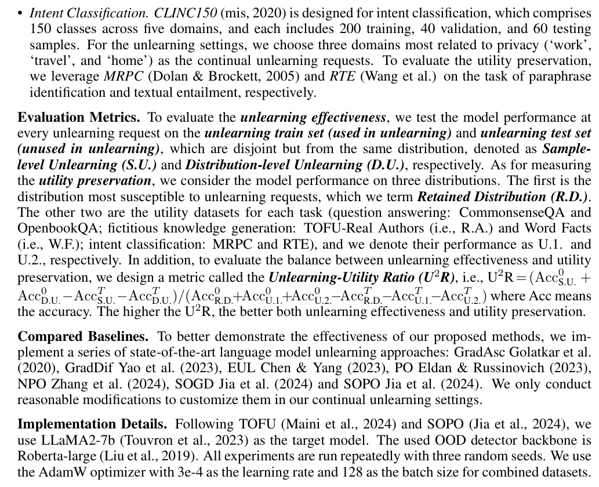

The epochs are 10 and 20 for ScienceQA-CommonsenseQA-OpenbookQA and CLINC150-MRPC- RTE. We set the LoRA rank for all experiments to 8. More details can be found in Appendix E.

4.2

## EFFECTIVENESS OF CONTINUAL LLM UNLEARNING WITHOUT RETAINED DATA

We conduct experiments on three tasks with continual unlearn requests and provide suffi-

cient retained data for all comparison base-

lines while assuming our O3 framework only

uses the data of each unlearning request and

does not use any retained data. We first cal-

culate the Unlearning-Utility Ratio, as shown

in Figure 2. The effectiveness of O3 is evident

as it always hits the highest U2R and signifi-

cantly surpasses the second best for all three

Figure 2: Comparison between ours and other

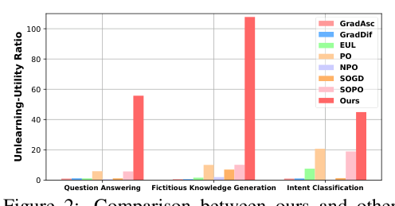

tasks. Beyond achieving superior performance

baseline approaches on Unlearning-Utility Ratio

across all tasks, our framework demonstrates

(U2R) that measures the balance between unlearn-

enhanced data and parameter efficiency. As in-

ing effectiveness and utility preservation.

dicated in Table 1, the quantity of training data required by our O3 framework is only half that of the baseline models since it does not necessitate using retained data. Moreover, the integration of LoRA significantly reduces the trainable parameters to 20M, which is even less than 3% of the baselines’ 6,758M. Our additional inference computation overhead is only 5.6% higher than the baselines, as detailed in Appendix F.1.

Table 1:

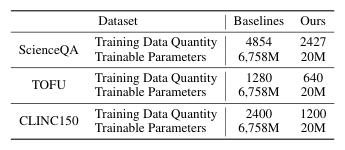

Comparison between

ours and other baselines on used

training data quantity and train-

able parameters. The trainable

parameters of baselines are all

the whole LLM.

(a) S.U. of ScienceQA

(b) D.U. of ScienceQA

Figure 3: Unlearning effectiveness comparison between ours

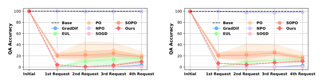

and other approaches on (a) sample-level unlearning (S.U.), (b)

distribution-level unlearning (D.U.) of ScienceQA.

(a) Retained Distribution

(b) CommonsenseQA

(c) OpenbookQA

Figure 4: Utility preservation performance comparison between ours and state-of-the-art unlearning approaches on the testing set of (a) Retained Distribution, (b) CommonsenseQA, (c) OpenbookQA, after unlearning each request of ScienceQA.

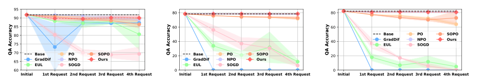

Question Answering. Figures 3(a) and 3(b) show the QA accuracy on the train and test set of unlearning data. We omit the results of GradAsc as it failed to generate meaningful answers for all distributions. We can easily observe that our O3 is located at the bottom tier, with only GradDif and SOGD being lower than O3. However, further examination of GradDif and SOGD revealed that they produce empty or nonsensical sentences filled with repeated tokens, which are considered an unlearning failure shown in Appendix F.2. Moreover, the utility preservation of GradDif and SOGD is extremely poor, as shown in Figure 4. In contrast, the QA accuracy of O3 on the retained distribution is slightly lower than the base model (the original target LLM without any unlearning), and O3 is even nearly the same as the base model on CommonsenseQA and OpenbookQA. Therefore, we can conclude that our O3 framework provides a much better balance in unlearning effectiveness and utility preservation than all baselines when facing continual unlearning requests.

Table 2: Performance Comparison between our O3 and other baselines when continually unlearning TOFU-forget01, -forget05, and -forget10 in Fictitious Knowledge Generation. The unlearning effectiveness is measured by the generation accuracy of the unlearning train data and unlearning test data denoted as S.U. and D.U., respectively. Utility preservation is evaluated by the generation accuracy of Retained Distribution (R.D.), TOFU-Real Authors (R.A.), and World Facts (W.F.).


Table 3: Performance Comparison between our O3 and other baselines when continually unlearning domain ‘work’, ‘travel’, and ‘home’ of CLINC150 in Intent Classification. The unlearning effectiveness is measured by the classification accuracy of the unlearning train data and unlearning test data denoted as S.U. and D.U., respectively. Utility preservation is evaluated by the accuracy of Retained Distribution (R.D.), MRPC, and RTE.


Fictitious Knowledge Generation. Table 2 presents the experiment results on TOFU. According to these results, we observe that our O3 achieves the best in both unlearning effectiveness and utility preservation, providing the best unlearning effectiveness in almost all cases but one, and the best utility preservation in the majority of cases. In the one case where O3 is not the best for unlearning effectiveness (i.e., D.U. for unlearning request 3, the better ones GradAsc and GradDif have almost completely lost model utility. We explain the metric details in Apppenix E.5.

Intent Classification. Table 3 presents the experiment results on CLINC150 dataset. Similar to QA, we observed consistent unlearning failures with GradDif, SOGD, and EUL methods. Moreover, both GradDif and SOGD demonstrated extremely poor performance in preserving utility. In contrast, our O3 framework achieves the best unlearning performance and maintains comparable or better results to the baselines that use retained data, both on the retained distribution and utility preservation. For instance, our O3 framework preserves the RTE performance more effectively than all baseline methods.

More Experiments. In Appendix C and F.3, we found existing unlearning approaches perform much poorer when the retained data becomes more limited. In the Appendix, we further demonstrate experiments on scaling the unlearning with more requests (F.4), unlearning multiple knowledge entities per request (F.5), Membership Inference Attacks (F.6), Detoxification (F.7), unlearning unsafe behaviors on benchmark WMDP (F.8), robustness of our O3 against targeted relearning attack (F.9), the evaluation of unlearning in terms of the Oracle model fine-tuned with only retained data (F.11) and the quantity-limited unlearning data (F.10).

4.3

## ABLATION STUDY

We conducted the ablation study as follows, and detailed the analysis in Appendix G.1.

Unlearning Knowledge Detection. We detach the use of contrastive entropy loss LCEL in O3 and use SimCLR (‘Ours w/ SimCLR’) and MoCo (‘Ours w/ MoCo’) with the augmentation using token masking. As for the scoring mechanism, we try using Mahalanobis Distance (dMaha in Eq. 10) and Cosine Similarity (dCos in Eq. 11) separately, which are termed as ‘Ours w/o dCos’ and ‘Ours w/o dMaha’. Besides, instead of using all model layers, we use only the last layer (‘Ours w/ last layer’).

Moreover, two state-of-the-art OOD detection approaches: MDF (Xu et al., 2021) and Agg (Darrin et al., 2024), are compared with ours. The experiments are conducted on fictitious knowledge generation and question answering. We report the AUROC in Table 4, where we can observe that the full design of our OOD detector in O3 framework always achieves the best AUROC.

Table 4: OOD detection performance comparison and ablation study between ours and others on Fictitious Knowledge Generation and Question Answering. The measurement is AUROC.

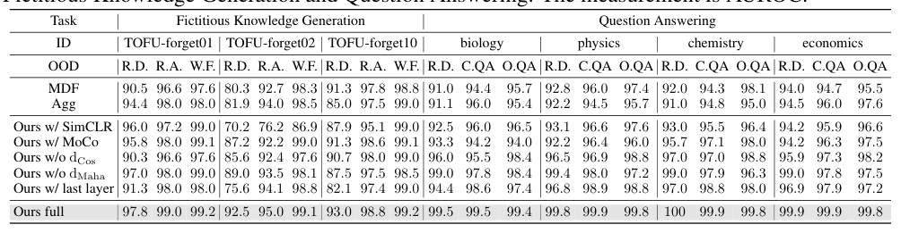

Table 6:

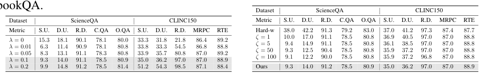

Hyper-parameter analysis of the

Table 5: Hyper-parameter analysis of the un-

soft-weighted inference of O3 framework.

learning knowledge optimization of O3 frame-

We adopt a hard-weighted (Hard-w) mech-

work. We adopt a series of values for the factor

```math
λ of Eq. 6 to validate the necessity of LOrth and
```

anism and change the scaling factor ζ of

analyze the sensitivity of λ. ‘C.QA’ shorts for

Eq. 13. ‘C.QA’ shorts for CommonsenseQA, and ‘O.QA’ shorts for OpenbookQA.

CommonsenseQA, and ‘O.QA’ shorts for Open-

Unlearning Knowledge Optimization. In the objective of unlearning knowledge optimization (Eq. 6), there is a factor λ balancing LCE and LOrth. We adopt 0, 0.01, 0.05, 0.1, and 0.2 for λ to validate the importance of LOrth and the sensitivity of λ. We conduct experiments on question answering and intent classification. Table 5 illustrates that employing orthogonal loss contributes to maintaining utility on the retained distribution and enhancing the unlearning effectiveness.

Soft-weighted Inference. Instead of using soft weights to load unlearning LoRA, we test a hardweighted strategy (‘Hard-w’ in Table 6). Specifically, we first calculate the hypersphere boundary distance range of the unlearning set DU,t, i.e., [min(dHt(DU,t)), max(dHt(DU,t))]. Then for each testing instance x, if its boundary distance dHt(x) is within the above range, we load the unlearning LoRA, otherwise, we detach the LoRA. We also conduct a sensitivity analysis of the scaling factor ζ in Eq. 13 with a series of values 1, 5, 50, and 100. These experiments are carried out on ScienceQA and CLINC150, and we report the performance after the last unlearning request in Table 6. We observe that the ‘Hard-w’ method performs poorly regarding unlearning knowledge. With an increase in the scaling factor ζ, our framework enhances its ability to unlearn knowledge more effectively.

More Analysis. We validate the robustness of O3 against adversarial attacks to bypass unlearning knowledge detection in Appendix G.2 and analyze the influence of the LoRA rank in Appendix G.3.

5

## CONCLUSION

In this work, we tackle practical challenges in developing machine unlearning techniques for LLMs, where existing state-of-the-art LLM unlearning approaches are often ineffective due to their heavy reliance on retained data and their failure to handle continual unlearning requests. To overcome these challenges, we propose an O3 framework that includes novel designs of an orthogonal low-rank adapter for continuously unlearning requested data and an out-of-distribution detector to measure the similarity between the input and unlearning data. Extensive experiments demonstrate that our O3 can achieve much more superior unlearning effectiveness and utility preservation than state-ofthe-art baselines without using any retained data when facing continuous unlearning requests.

## REPRODUCIBILITY STATEMENT

Our source codes to reproduce experiment results (with instructions for running the code) have been provided at https://github.com/GCYZSL/O3-LLM-UNLEARNING. We use public datasets and provide implementation details in the following Appendix.

## REFERENCES

CLINC150. UCI Machine Learning Repository, 2020. DOI: https://doi.org/10.24432/C5MP58.

Amey Agrawal, Nitin Kedia, Jayashree Mohan, Ashish Panwar, Nipun Kwatra, Bhargav Gulavani, Ramachandran Ramjee, and Alexey Tumanov. Vidur: A large-scale simulation framework for llm inference. Proceedings of Machine Learning and Systems, 6:351–366, 2024.

Lucas Bourtoule, Varun Chandrasekaran, Christopher A Choquette-Choo, Hengrui Jia, Adelin Travers, Baiwu Zhang, David Lie, and Nicolas Papernot. Machine unlearning. In 2021 IEEE Symposium on Security and Privacy (SP), pp. 141–159. IEEE, 2021.

Chentao Cao, Zhun Zhong, Zhanke Zhou, Yang Liu, Tongliang Liu, and Bo Han. Envisioning outlier exposure by large language models for out-of-distribution detection. arXiv preprint arXiv:2406.00806, 2024.

Ting-Yun Chang, Jesse Thomason, and Robin Jia. Do localization methods actually localize memorized data in llms? a tale of two benchmarks. In Proceedings of the 2024 Conference of the North American Chapter of the Association for Computational Linguistics: Human Language Technologies (Volume 1: Long Papers), pp. 3190–3211, 2024.

Jiaao Chen and Diyi Yang. Unlearn what you want to forget: Efficient unlearning for llms. In The 2023 Conference on Empirical Methods in Natural Language Processing, 2023.

Jiefeng Chen, Yixuan Li, Xi Wu, Yingyu Liang, and Somesh Jha. Robust out-of-distribution detection for neural networks. In The AAAI-22 Workshop on Adversarial Machine Learning and Beyond.

Ruizhe Chen, Tianxiang Hu, Yang Feng, and Zuozhu Liu. Learnable privacy neurons localization in language models. arXiv preprint arXiv:2405.10989, 2024.

Maxime Darrin, Guillaume Staerman, Eduardo Dadalto Cˆamara Gomes, Jackie CK Cheung, Pablo Piantanida, and Pierre Colombo. Unsupervised layer-wise score aggregation for textual ood detection. In Proceedings of the AAAI Conference on Artificial Intelligence, volume 38, pp. 17880– 17888, 2024.

Roy De Maesschalck, Delphine Jouan-Rimbaud, and D´esir´e L Massart. The mahalanobis distance. Chemometrics and intelligent laboratory systems, 50(1):1–18, 2000.

Ning Ding, Yujia Qin, Guang Yang, Fuchao Wei, Zonghan Yang, Yusheng Su, Shengding Hu, Yulin Chen, Chi-Min Chan, Weize Chen, et al. Parameter-efficient fine-tuning of large-scale pre-trained language models. Nature Machine Intelligence, 5(3):220–235, 2023.

Yiran Ding, Li Lyna Zhang, Chengruidong Zhang, Yuanyuan Xu, Ning Shang, Jiahang Xu, Fan Yang, and Mao Yang. Longrope: Extending llm context window beyond 2 million tokens. In Forty-first International Conference on Machine Learning.

Bill Dolan and Chris Brockett. Automatically constructing a corpus of sentential paraphrases. In Third international workshop on paraphrasing (IWP2005), 2005.

Ronen Eldan and Mark Russinovich. Who’s harry potter? approximate unlearning in llms. arXiv preprint arXiv:2310.02238, 2023.

Sarah M Erfani, Sutharshan Rajasegarar, Shanika Karunasekera, and Christopher Leckie. Highdimensional and large-scale anomaly detection using a linear one-class svm with deep learning. Pattern Recognition, 58:121–134, 2016.

Chongyang Gao, Kezhen Chen, Jinmeng Rao, Baochen Sun, Ruibo Liu, Daiyi Peng, Yawen Zhang, Xiaoyuan Guo, Jie Yang, and VS Subrahmanian. Higher layers need more lora experts. arXiv preprint arXiv:2402.08562, 2024a.

Chongyang Gao, Kang Gu, Soroush Vosoughi, and Shagufta Mehnaz. Semantic-preserving adversarial example attack against bert. In Proceedings of the 4th Workshop on Trustworthy Natural Language Processing (TrustNLP 2024), pp. 202–207, 2024b.

Chongyang Gao, Yiren Jian, Natalia Denisenko, Soroush Vosoughi, and VS Subrahmanian. Gem: generating engaging multimodal content. In Proceedings of the Thirty-Third International Joint Conference on Artificial Intelligence, pp. 7654–7662, 2024c.

T Gao, X Yao, and Danqi Chen. Simcse: Simple contrastive learning of sentence embeddings. In EMNLP 2021-2021 Conference on Empirical Methods in Natural Language Processing, Proceedings, 2021.

General Data Protection Regulation GDPR. General data protection regulation. URL: https://gdprinfo. eu/[accessed 2020-11-21], 2018.

Samuel Gehman, Suchin Gururangan, Maarten Sap, Yejin Choi, and Noah A Smith. Realtoxicityprompts: Evaluating neural toxic degeneration in language models. In Findings of the Association for Computational Linguistics: EMNLP 2020, pp. 3356–3369, 2020.

Aditya Golatkar, Alessandro Achille, and Stefano Soatto. Eternal sunshine of the spotless net: Selective forgetting in deep networks. In Proceedings of the IEEE/CVF Conference on Computer Vision and Pattern Recognition, pp. 9304–9312, 2020.

Jia-Chen Gu, Hao-Xiang Xu, Jun-Yu Ma, Pan Lu, Zhen-Hua Ling, Kai-Wei Chang, and Nanyun arXiv preprint Peng. Model editing can hurt general abilities of large language models. arXiv:2401.04700, 2024.

Junfeng Guo, Yiming Li, Lixu Wang, Shu-Tao Xia, Heng Huang, Cong Liu, and Bo Li. Domain watermark: Effective and harmless dataset copyright protection is closed at hand. Advances in Neural Information Processing Systems, 36:54421–54450, 2023.

Akshat Gupta, Anurag Rao, and Gopala Anumanchipalli. Model editing at scale leads to gradual and catastrophic forgetting. arXiv preprint arXiv:2401.07453, 2024.

Suchin Gururangan, Ana Marasovi´c, Swabha Swayamdipta, Kyle Lo, Iz Beltagy, Doug Downey, and Noah A Smith. Don’t stop pretraining: Adapt language models to domains and tasks. In Proceedings of the 58th Annual Meeting of the Association for Computational Linguistics, pp. 8342–8360, 2020.

Kaiming He, Haoqi Fan, Yuxin Wu, Saining Xie, and Ross Girshick. Momentum contrast for In Proceedings of the IEEE/CVF conference on unsupervised visual representation learning. computer vision and pattern recognition, pp. 9729–9738, 2020.

Edward J Hu, Phillip Wallis, Zeyuan Allen-Zhu, Yuanzhi Li, Shean Wang, Lu Wang, Weizhu Chen, et al. Lora: Low-rank adaptation of large language models. In International Conference on Learning Representations, 2021.

Shengyuan Hu, Yiwei Fu, Steven Wu, and Virginia Smith. Jogging the memory of unlearned models through targeted relearning attacks. In ICML 2024 Workshop on Foundation Models in the Wild, 2024.

Jing Huang, Zhengxuan Wu, Christopher Potts, Mor Geva, and Atticus Geiger. Ravel: Evaluating interpretability methods on disentangling language model representations. arXiv preprint arXiv:2402.17700, 2024.

Joel Jang, Dongkeun Yoon, Sohee Yang, Sungmin Cha, Moontae Lee, Lajanugen Logeswaran, and Minjoon Seo. Knowledge unlearning for mitigating privacy risks in language models. In Proceedings of the 61st Annual Meeting of the Association for Computational Linguistics (Volume 1: Long Papers), pp. 14389–14408, 2023.

Jiaming Ji, Mickel Liu, Josef Dai, Xuehai Pan, Chi Zhang, Ce Bian, Boyuan Chen, Ruiyang Sun, Yizhou Wang, and Yaodong Yang. Beavertails: Towards improved safety alignment of llm via a human-preference dataset. Advances in Neural Information Processing Systems, 36, 2024.

Jinghan Jia, Yihua Zhang, Yimeng Zhang, Jiancheng Liu, Bharat Runwal, James Diffenderfer, Bhavya Kailkhura, and Sijia Liu. Soul: Unlocking the power of second-order optimization for llm unlearning. arXiv preprint arXiv:2404.18239, 2024.

Yiren Jian, Chongyang Gao, and Soroush Vosoughi. Contrastive learning for prompt-based few-shot language learners. arXiv preprint arXiv:2205.01308, 2022a.

Yiren Jian, Chongyang Gao, and Soroush Vosoughi. Non-linguistic supervision for contrastive learning of sentence embeddings. Advances in Neural Information Processing Systems, 35:35533– 35548, 2022b.

Ruochen Jiao, Shaoyuan Xie, Justin Yue, TAKAMI SATO, Lixu Wang, Yixuan Wang, Qi Alfred Chen, and Qi Zhu. Can we trust embodied agents? exploring backdoor attacks against embodied llm-based decision-making systems. In The Thirteenth International Conference on Learning Representations, 2025.

Jared Kaplan, Sam McCandlish, Tom Henighan, Tom B Brown, Benjamin Chess, Rewon Child, Scott Gray, Alec Radford, Jeffrey Wu, and Dario Amodei. Scaling laws for neural language models. arXiv preprint arXiv:2001.08361, 2020.

Hao Lang, Yinhe Zheng, Jian Sun, Fei Huang, Luo Si, and Yongbin Li. Estimating soft labels for out-of-domain intent detection. In Proceedings of the 2022 Conference on Empirical Methods in Natural Language Processing, pp. 261–276, 2022.

Rikard Laxhammar, Goran Falkman, and Egils Sviestins. Anomaly detection in sea traffic-a comparison of the gaussian mixture model and the kernel density estimator. In 2009 12th international conference on information fusion, pp. 756–763. IEEE, 2009.

Nathaniel Li, Alexander Pan, Anjali Gopal, Summer Yue, Daniel Berrios, Alice Gatti, Justin D Li, Ann-Kathrin Dombrowski, Shashwat Goel, Long Phan, et al. The wmdp benchmark: Measuring and reducing malicious use with unlearning. arXiv preprint arXiv:2403.03218, 2024.

Stephanie Lin, Jacob Hilton, and Owain Evans. Truthfulqa: Measuring how models mimic human falsehoods. In Proceedings of the 60th Annual Meeting of the Association for Computational Linguistics (Volume 1: Long Papers), pp. 3214–3252, 2022.

Sijia Liu, Yuanshun Yao, Jinghan Jia, Stephen Casper, Nathalie Baracaldo, Peter Hase, Xiaojun Xu, Yuguang Yao, Hang Li, Kush R Varshney, et al. Rethinking machine unlearning for large language models. arXiv preprint arXiv:2402.08787, 2024.

Yinhan Liu, Myle Ott, Naman Goyal, Jingfei Du, Mandar Joshi, Danqi Chen, Omer Levy, Mike Lewis, Luke Zettlemoyer, and Veselin Stoyanov. Roberta: A robustly optimized bert pretraining approach. arXiv preprint arXiv:1907.11692, 2019.

Pan Lu, Swaroop Mishra, Tanglin Xia, Liang Qiu, Kai-Wei Chang, Song-Chun Zhu, Oyvind Tafjord, Peter Clark, and Ashwin Kalyan. Learn to explain: Multimodal reasoning via thought chains for science question answering. Advances in Neural Information Processing Systems, 35:2507–2521, 2022a.

Pan Lu, Swaroop Mishra, Tanglin Xia, Liang Qiu, Kai-Wei Chang, Song-Chun Zhu, Oyvind Tafjord, Peter Clark, and Ashwin Kalyan. Learn to explain: Multimodal reasoning via thought chains for science question answering. Advances in Neural Information Processing Systems, 35:2507–2521, 2022b.

Pratyush Maini, Zhili Feng, Avi Schwarzschild, Zachary C Lipton, and J Zico Kolter. Tofu: A task of fictitious unlearning for llms. arXiv preprint arXiv:2401.06121, 2024.

Kevin Meng, David Bau, Alex Andonian, and Yonatan Belinkov. Locating and editing factual associations in gpt. Advances in Neural Information Processing Systems, 35:17359–17372, 2022.

Todor Mihaylov, Peter Clark, Tushar Khot, and Ashish Sabharwal. Can a suit of armor conduct electricity? a new dataset for open book question answering. In Proceedings of the 2018 Conference on Empirical Methods in Natural Language Processing, pp. 2381–2391, 2018.

Guillermo Ortiz-Jimenez, Alessandro Favero, and Pascal Frossard. Task arithmetic in the tangent space: Improved editing of pre-trained models. Advances in Neural Information Processing Systems, 36, 2024.

Yawen Ouyang, Yongchang Cao, Yuan Gao, Zhen Wu, Jianbing Zhang, and Xinyu Dai. On prefixtuning for lightweight out-of-distribution detection. In Proceedings of the 61st Annual Meeting of the Association for Computational Linguistics (Volume 1: Long Papers), pp. 1533–1545, 2023.

Xudong Pan, Mi Zhang, Shouling Ji, and Min Yang. Privacy risks of general-purpose language models. In 2020 IEEE Symposium on Security and Privacy (SP), pp. 1314–1331. IEEE, 2020.

Martin Pawelczyk, Seth Neel, and Himabindu Lakkaraju. In-context unlearning: Language models as few shot unlearners. ICML, 2024.

Rifkie Primartha and Bayu Adhi Tama. Anomaly detection using random forest: A performance revisited. In 2017 International conference on data and software engineering (ICoDSE), pp. 1–6. IEEE, 2017.

Xiangyu Qi, Yi Zeng, Tinghao Xie, Pin-Yu Chen, Ruoxi Jia, Prateek Mittal, and Peter Henderson. Fine-tuning aligned language models compromises safety, even when users do not intend to! In The Twelfth International Conference on Learning Representations.

Nils Reimers and Iryna Gurevych. Sentence-bert: Sentence embeddings using siamese bertnetworks. In Proceedings of the 2019 Conference on Empirical Methods in Natural Language Processing, 2019.

Victor Sanh, Albert Webson, Colin Raffel, Stephen H Bach, Lintang Sutawika, Zaid Alyafeai, Antoine Chaffin, Arnaud Stiegler, Teven Le Scao, Arun Raja, et al. Multitask prompted training enables zero-shot task generalization. arXiv preprint arXiv:2110.08207, 2021.

Weijia Shi, Anirudh Ajith, Mengzhou Xia, Yangsibo Huang, Daogao Liu, Terra Blevins, Danqi Chen, and Luke Zettlemoyer. Detecting pretraining data from large language models. arXiv preprint arXiv:2310.16789, 2023.

Chandan Singh, Jeevana Priya Inala, Michel Galley, Rich Caruana, and Jianfeng Gao. Rethinking interpretability in the era of large language models. arXiv preprint arXiv:2402.01761, 2024.

Lichao Sun, Yue Huang, Haoran Wang, Siyuan Wu, Qihui Zhang, Chujie Gao, Yixin Huang, Wenhan Lyu, Yixuan Zhang, Xiner Li, et al. Trustllm: Trustworthiness in large language models. arXiv preprint arXiv:2401.05561, 2024.

Jihoon Tack, Sangwoo Mo, Jongheon Jeong, and Jinwoo Shin. Csi: Novelty detection via contrastive learning on distributionally shifted instances. Advances in neural information processing systems, 33:11839–11852, 2020.

Alon Talmor, Jonathan Herzig, Nicholas Lourie, and Jonathan Berant. Commonsenseqa: A question answering challenge targeting commonsense knowledge. In Proceedings of the 2019 Conference of the North American Chapter of the Association for Computational Linguistics: Human Language Technologies, Volume 1 (Long and Short Papers), pp. 4149–4158, 2019.

Rohan Taori, Ishaan Gulrajani, Tianyi Zhang, Yann Dubois, Xuechen Li, Carlos Guestrin, Percy Liang, and Tatsunori B Hashimoto. Alpaca: A strong, replicable instructionfollowing model. Stanford Center for Research on Foundation Models. https://crfm. stanford. edu/2023/03/13/alpaca. html, 3(6):7, 2023.

Pratiksha Thaker, Yash Maurya, and Virginia Smith. Guardrail baselines for unlearning in llms. arXiv preprint arXiv:2403.03329, 2024.

Hugo Touvron, Louis Martin, Kevin Stone, Peter Albert, Amjad Almahairi, Yasmine Babaei, Nikolay Bashlykov, Soumya Batra, Prajjwal Bhargava, Shruti Bhosale, et al. Llama 2: Open foundation and fine-tuned chat models. arXiv preprint arXiv:2307.09288, 2023.

Rheeya Uppaal, Junjie Hu, and Yixuan Li. Is fine-tuning needed? pre-trained language models are near perfect for out-of-domain detection. In Proceedings of the 61st Annual Meeting of the Association for Computational Linguistics (Volume 1: Long Papers), pp. 12813–12832, 2023.

Alex Wang, Amanpreet Singh, Julian Michael, Felix Hill, Omer Levy, and Samuel R Bowman. Glue: A multi-task benchmark and analysis platform for natural language understanding. In International Conference on Learning Representations.

Lei Wang, Chen Ma, Xueyang Feng, Zeyu Zhang, Hao Yang, Jingsen Zhang, Zhiyuan Chen, Jiakai Tang, Xu Chen, Yankai Lin, et al. A survey on large language model based autonomous agents. Frontiers of Computer Science, 18(6):186345, 2024.

Lixu Wang, Shichao Xu, Ruiqi Xu, Xiao Wang, and Qi Zhu. Non-transferable learning: A new approach for model ownership verification and applicability authorization. In International Conference on Learning Representations, 2022.

Xiao Wang, Tianze Chen, Qiming Ge, Han Xia, Rong Bao, Rui Zheng, Qi Zhang, Tao Gui, and Xuanjing Huang. Orthogonal subspace learning for language model continual learning. arXiv preprint arXiv:2310.14152, 2023.

Boyi Wei, Kaixuan Huang, Yangsibo Huang, Tinghao Xie, Xiangyu Qi, Mengzhou Xia, Prateek Mittal, Mengdi Wang, and Peter Henderson. Assessing the brittleness of safety alignment via pruning and low-rank modifications. In Forty-first International Conference on Machine Learning.

Xinwei Wu, Junzhuo Li, Minghui Xu, Weilong Dong, Shuangzhi Wu, Chao Bian, and Deyi Xiong. Depn: Detecting and editing privacy neurons in pretrained language models. In The 2023 Conference on Empirical Methods in Natural Language Processing, 2023.

Keyang Xu, Tongzheng Ren, Shikun Zhang, Yihao Feng, and Caiming Xiong. Unsupervised outof-domain detection via pre-trained transformers. In Proceedings of the 59th Annual Meeting of the Association for Computational Linguistics and the 11th International Joint Conference on Natural Language Processing (Volume 1: Long Papers), pp. 1052–1061, 2021.

Jingkang Yang, Kaiyang Zhou, Yixuan Li, and Ziwei Liu. Generalized out-of-distribution detection: A survey. arXiv preprint arXiv:2110.11334, 2021.

Yuanshun Yao, Xiaojun Xu, and Yang Liu. Large language model unlearning. In Socially Responsible Language Modelling Research, 2023.

Charles Yu, Sullam Jeoung, Anish Kasi, Pengfei Yu, and Heng Ji. Unlearning bias in language models by partitioning gradients. In Findings of the Association for Computational Linguistics: ACL 2023, pp. 6032–6048, 2023.

Dawen Zhang, Pamela Finckenberg-Broman, Thong Hoang, Shidong Pan, Zhenchang Xing, Mark Staples, and Xiwei Xu. Right to be forgotten in the era of large language models: Implications, challenges, and solutions. arXiv preprint arXiv:2307.03941, 2023.

Ruiqi Zhang, Licong Lin, Yu Bai, and Song Mei. Negative preference optimization: From catastrophic collapse to effective unlearning. arXiv preprint arXiv:2404.05868, 2024.

Yang Zhao, Jiaxi Yang, Yiling Tao, Lixu Wang, Xiaoxiao Li, and Dusit Niyato. A survey of federated unlearning: A taxonomy, challenges and future directions. arXiv e-prints, pp. arXiv–2310, 2023.

Yunhua Zhou, Jianqiang Yang, Pengyu Wang, and Xipeng Qiu. Two birds one stone: Dynamic ensemble for ood intent classification. In Proceedings of the 61st Annual Meeting of the Association for Computational Linguistics (Volume 1: Long Papers), pp. 10659–10673, 2023.

Bo Zong, Qi Song, Martin Renqiang Min, Wei Cheng, Cristian Lumezanu, Daeki Cho, and Haifeng Chen. Deep autoencoding gaussian mixture model for unsupervised anomaly detection. In International conference on learning representations, 2018.

## APPENDIX

This Appendix includes additional details for the submitted paper “On Large Language Model Continual Unlearning” including the following aspects:

- Section. A: discussion of real-world challenges for LLM unlearning and external blocking design.

- Section. B: discussion of external blocking design.

- Section C: empirical study about the importance of retained data for existing LLM unlearning

approaches.

- Section D: detailed algorithm pipelines.

- Section E: more implementation details including dataset details (E.2), instruct-tuning details

(E.3), random labeling-based preference optimization (E.4), and metric explanation for fictitious knowledge generation (E.5).

- Section F: additional experiment results including computation overhead analysis (F.1), failure

cases of the baselines (F.2), experiments on existing unlearning approaches with limited retained data (F.3), scale the unlearning with more requests (F.4), unlearning multi-entity knowledge (F.5), membership inference attacks (F.6), detoxification (F.7), unlearning unsafe behaviors (F.8), targeted relearning attack (F.9), O3 with limited unlearning data (F.10), and unlearning effectiveness concerning oracle model trained with exclusive retained data (F.11).

- Section G: more ablation study and analysis including more detailed analysis of ablation study

in the main context (G.1), experiments of conducting adversarial attacks to bypass unlearning knowledge detection (G.2), sensitivity analysis of the rank of LoRA (G.3).

- Section H: potential future works including improvement for unlearning knowledge detection

(H.1) and data selection for LLM utility preservation (H.2).

- Section I: broader impact of O3 framework.

A

## REAL-WORLD CHALLENGES FOR LLM UNLEARNING

This work considers the following challenges when applying LLM unlearning to real-world applications.

- Data Availability. For the data needed to be unlearned, we assume they are available during the

unlearning operation (Liu et al., 2024; Zhao et al., 2023). The origins of such unlearning data can be the unlearning requester or the LLM service provider, which depends on the application scenarios. After the unlearning, such unlearning data becomes unavailable due to data privacy, intellectual property (Guo et al., 2023), and usage authorization (Wang et al., 2022) regulations. Similarly, the retained training dataset of the target LLM cannot be assumed to be entirely available during unlearning due to these regulations. In addition to the raw data, we assume there is no task label for the unlearning and retained datasets, though there might be some in practice.

- Continual Unlearning. In real-world applications, the LLM unlearning requests emerge contin-

uously over time. For instance, attackers launch adversarial attacks (Gao et al., 2024b; Jiao et al.,

2025) when LLM continuously learns new data; daily users periodically want to delete dialog

history; the knowledge becomes outdated and incorrect over time. To deal with these continuous unlearning requests, the LLM unlearning should be operated effectively and, more importantly, alleviate the cumulative catastrophic utility loss. The utility implies the LLM’s performance on other tasks that are disjoint from the unlearning requests.

- Computation Efficiency. Although existing LLM unlearning methods may adopt various approx-

imation approaches rather than retraining to reduce the computation overhead, there are further efforts that can enhance efficiency. Given that LLMs are typically built upon large-scale transformers, unlearning does not have to be conducted across the entire model. Instead, a better choice is to adopt some parameter-efficient fine-tuning (PEFT) strategies (Ding et al., 2023; Hu et al., 2021; Gao et al., 2024a) to reduce the computation cost. Moreover, reducing or eliminating the use of the retained dataset also improves efficiency, especially considering the challenges in accessing the entire retained training data due to various regulations mentioned above. Adopting the PEFT strategy at the model level and minimizing the use of the retained dataset at the data level

is particularly beneficial for efficiency, given the cumulative computation overhead in responding to continual unlearning requests.

B

## EXTERNAL BLOCKING DESIGN

In real-world scenarios, it is often unnecessary and unpractical to unlearn knowledge exactly from LLMs. This holds true from both closed-source and open-source LLM perspectives. Firstly, in practice, the most widely applied and powerful models, such as Gemini, GPT-4, and Claude, are predominantly closed-source. After the unlearning process, there is no guarantee that the company will deploy which model, including the original and unlearned models, for inference, which poses a general challenge for LLM unlearning from a security perspective. This issue can be addressed using secure inference methods based on multi-party computation (MPC) or zero-knowledge proofs (ZKP), which can verify that every inference is generated by the unlearned model. Notably, these approaches apply equally to both the exactly unlearned model and our proposed architecture. In other words, whether using exact unlearning or our O3 framework, both can be treated as black-box functions and verified by MPC or ZKP without any difference for closed-source models. We plan to implement secure inference for O3 in the future. Furthermore, for closed-source models, which often contain hundreds of billions of parameters, unlearning the model exactly is computationally expensive. Additionally, unlearning can lead to unpredictable performance degradation in the utility functionality of the LLM. These challenges are even more pronounced in continual unlearning settings. Our experiments in the Appendix also demonstrate that with continuously arriving unlearning requests, e.g., daily users periodically want to delete dialog history, catastrophic forgetting accumulates over time. Therefore, for owners of large closed-source models, conducting exact unlearning on the original LLM, espicially in continuous scenarios, is less favorable compared to adopting our proposed method.

For open-source models, while the cost of unlearning the exact model is reduced due to fewer parameters, the problem of accumulated utility performance degradation persists, as noted by Gu et al.

(2024) and demonstrated by our experiments in Appendix. C. Additionally, it is infrequent for open-

source model providers, such as those behind the LLaMA, Gemma, and Phi series, to update their models regularly. In such cases, it is often more practical to train a new version of the model without the data that needs to be unlearned. For users of open-source models who need to unlearn frequently, e.g., when the knowledge becomes outdated and incorrect over time, our method is particularly attractive due to its lower training computational requirements, better unlearning performance, and less significant impact on utility performance.

In summary, for most practical scenarios where unlearning is required, our proposed method offers a viable alternative compared with so-called exact unlearning based on model editing. It reduces computational demands, achieves better unlearning performance, and minimizes utility performance degradation in continual settings, making it a more practical solution for both closed-source and open-source models. Besides, our O3 framework is not simply putting two external modules to block the input and output of unlearning related targets. Owing to the innovative architecture design and the proposal of a well-crafted OOD module and orthogonal LoRA, O3 can be advantageous with the above practical benefits. Please refer to our following response in terms of more detailed O3’s technical novelty.

C

## EMPIRICAL STUDY ABOUT RETAINED DATA FOR EXISTING LLM

## UNLEARNING

In this section, we use a motivating empirical study to demonstrate the challenges related to data availability and continual unlearning. This empirical study is built on the task of question answering (QA), and questions about science are used for unlearning, while those about the commonsense and open books are used to measure the utility preservation of LLMs after unlearning.

C.1

## IMPACT OF RETAINED DATASET AVAILABILITY

As mentioned in Section A, full access to the entire retained training dataset of LLM is often impossible. Following existing LLM unlearning studies, we view the data drawn from similar and relevant

Figure 5: The performance of state-of-the-art unlearning approaches on the testing data from the retained distribution after unlearning the last request of ScienceQA when they are allowed to access the retained dataset with varying quantities.

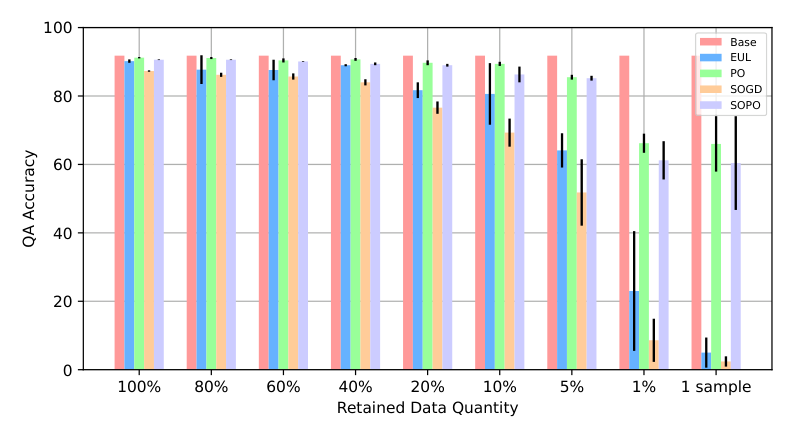

Figure 6: The performance of state-of-the-art unlearning approaches on the testing data from the retained distribution after unlearning the last request of ScienceQA when they are allowed to access the retained dataset containing varying ratios of samples from the retained and irrelevant distributions.


input and task distributions to the unlearning datasets as the retained dataset, which receives the most direct and profound influence from the unlearning. In the empirical study, for example, the retained dataset is the residual samples of ScienceQA except for the biology at the 1st unlearning request. To demonstrate the importance of the retained dataset, we conduct experiments in terms of data quantity and distribution as follows.

Retained Data Quantity. We randomly select 100%, 80%, 60%, 40%, 20%, 10%, 5%, 1%, and 1 sample(s) from the original retained dataset to construct the new retained datasets. Then, baseline unlearning approaches use these retained datasets for continual unlearning requests. Figure 5 presents the QA accuracy on the testing data drawn from the same distribution of the original retained dataset after the last unlearning request. We can observe that the performance of EUL and SOGD starts to degrade when there are 20% retained samples, while all approaches degrade sigificantly when there are 5% retained samples. Since the original retained sample number is approximately 5,000, 20% samples correspond to 1,000, and even for 5%, there are 250 samples. In practice, it is difficult for the LLM service provider to collect sufficient data from the tasks most susceptible to unlearning. The difficulties lie in several facets. First, characterizing and localizing the tasks susceptible to unlearning is difficult (please refer to Section H.2 for more discussion). Second,

their corresponding data may be limited. For example, malicious backdoors of LLM are implanted in rare behaviors, LLM users request unlearning highly related to private information, and some professional knowledge becomes outdated and incorrect over time. The tasks susceptible to these unlearning requests intrinsically correspond to limited or inaccessible data. Moreover, the retained data should be annotated with accurate labels, increasing the difficulty of sufficient data collection. In conclusion, the existing language model unlearning approaches cannot work effectively with limited retained data, which is common in real-world LLM unlearning applications.

Retained Data Distribution. As the data from similar distributions to the unlearning requests is hard to acquire, one of the possible solutions is to leverage the data from other irrelevant distributions. We substitute 20%, 40%, 60%, 80%, 90%, 95%, 99%, and 100% original retained data of ScienceQA with equal numbers of samples from CommonsenseQA to conduct the experiments. Figure 6 depicts the QA accuracy on the testing retained dataset of ScienceQA after unlearning the last request. It is easy to observe that all baseline approaches drop significantly when 90% retained samples come from non-ScienceQA. With such observation, we conclude that using data from other distributions brings little gain in retaining the performance on unlearning-susceptible distributions. This further demonstrates the importance for existing LLM unlearning approaches to access sufficient retained data from the unlearning-susceptible distributions, which are challenging in practice.

Figure 7: The performance of state-of-the-art unlearning approaches on the testing data of CommonsenseQA, after unlearning each request of ScienceQA.

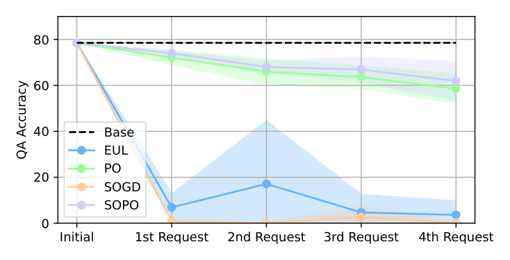

Figure 8: The performance of state-of-the-art unlearning approaches on the testing data of OpenbookQA, after unlearning each request of ScienceQA.

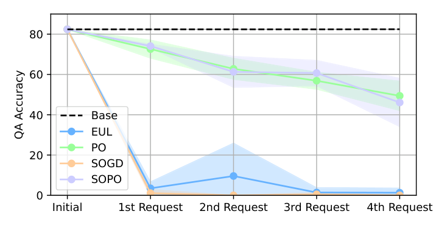

C.2

## CUMULATIVE CATASTROPHIC UTILITY FORGETTING

In addition to the tasks most susceptible to unlearning, the model utility on all other tasks and distribution encounters catastrophic forgetting in varying degrees. With the continuously arriving

unlearning requests, catastrophic forgetting is accumulating. Therefore, even if the utility loss of a single unlearning operation may be marginal, the cumulative loss from multiple unlearning requests could be significant. In our empirical study, we investigate the performance change of CommonsenseQA and OpenbookQA when unlearning the requests from ScienceQA, as shown in Figures 7 and 8, respectively. We can observe a sharp accuracy drop for EUL and SOGD on both CommonsenseQA and OpenbookQA, even after unlearning the first request. Although the performance degrading trend of PO and SOPO is slower, their cumulative accuracy reduction at the fourth request achieves 20% on CommonsenseQA and 30% on OpenbookQA. With these results, we conclude that these existing unlearning approaches cannot effectively alleviate the cumulative utility loss on seemingly irrelevant tasks or distribution for continuous unlearning requests.

D

## ALGORITHM PIPELINES

The detailed pipeline of unlearning knowledge detection is shown in Algorithm 1. At a high level, the module fine-tunes an out-of-distribution (OOD) detector backbone model on the data of the t-th unlearning request with the contrastive entropy loss. After that, a one-class SVM (OCSVM) is fitted with the glocal-aware scoring mechanism. The OOD detector backbone and the fitted OCSVM are used to assess the input and unlearning data similarity, which allows the O3 framework to decide whether and to what extent to load the unlearning LoRA in the inference phase.

In addition, the soft-weighted inference of O3 framework is shown in Algorithm 2. The softweighted inference leverages the OOD module to assess the similarity between the input and seen unlearning data, then decides whether and to what extent to load the unlearning LoRA.

E

## MORE IMPLEMENTATION DETAILS

E.1

## IMPLEMENTATION DETAILS

Following TOFU (Maini et al., 2024) and SOPO (Jia et al., 2024), we use LLaMA2-7b-chat (Touvron et al., 2023) as the target model for TOFU and LLaMA2-7b for other datasets. More details are shown in Appendix To equip the target model with all knowledge of fictitious knowledge generation, we fine-tune LLaMA2-7b-chat on the entire dataset of TOFU. As for intent classification and question answering, we conduct instruct tuning with the combined datasets CLINC150-MRPC-RTE and ScienceQA-CommonsenseQA-OpenbookQA, respectively. The used OOD detector backbone model is the pre-trained Roberta-large (Liu et al., 2019). All experiments are run repeatedly with three random seeds (seed 0, 1, 2), and we report the mean and standard deviation. We use the AdamW optimizer with 3e-4 as the learning rate and 128 as the batch size for combined datasets. The epochs are 10 and 20 for ScienceQA-CommonsenseQA-OpenbookQA and CLINC150-MRPC- RTE, respectively. We set the LoRA rank for all experiments to 8 and the alpha to 16.

E.2

## DATASET DETAILS

We provide more dataset details in Table. 7.

E.3

## INSTRUCT-TUNING DETAILS

We conducted instruction tuning (Sanh et al., 2021) on the LLaMA2-7b model to prepare target models for intent classification (CLINC150-MRPC-RTE) and question answering (ScienceQA- CommonsenseQA-OpenbookQA) tasks. Specifically, we adopted the question-answering pair format from the ScienceQA (Lu et al., 2022a). Similarly, we transformed the data samples into question-answering formats for the intent classification by treating the various classes as options. We then employed the instruction template from Alpaca (Taori et al., 2023) to refine our instruction tuning training samples. Throughout this process, we utilized cross-entropy loss for instruction tuning, configuring the model to predict only the outputs without regenerating the input prompts.

Algorithm 1: Unlearning Knowledge Detection Require: The original pre-trained OOD detector backbone model FΩwith L layers; Randomly initialized LoRA parameters for OOD rt F ; A randomly initialized OCSVM with the hypersphere Ht; The unlearning dataset at the t-th stage DU,t; Representation learning training epochs E.

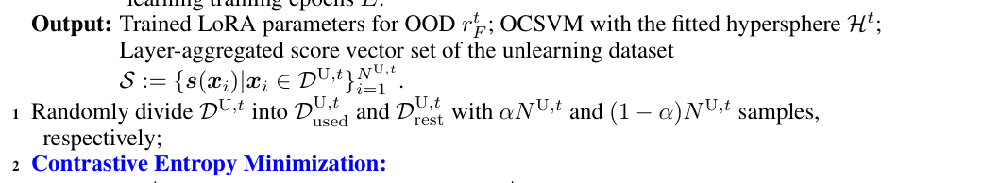

## 3 Copy FΩ◦rt

F to initialize a key encoder FΩkey ◦rt F key;

## 4 for e from 1 to E do

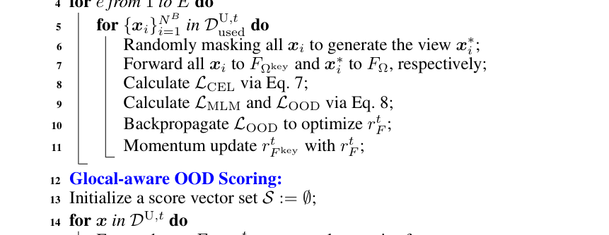

Forward x to FΩ◦rt F to extract layer-wise features; 15

## 16 for l from 1 to L do

Calculate the empirical mean and covariance on the layer-wise features of DU,t used via Eq. 9; 17

Calculate dMaha(x)l for DU,t via Eq. 10; 18

Calculate dCos(x)l for DU,t via Eq. 11; 19

Calculate the layer-wise score s(x)l for DU,t via Eq. 11; 20

21 Concatenate layer-wise scores of DU,t into score vectors s(x) := [s(x)1, · · · , s(x)L] and include them into S;

## 22 Fit the OCSVM with score vectors of DU,t

used to update Ht;

Algorithm 2: Soft-weighted Inference of O3

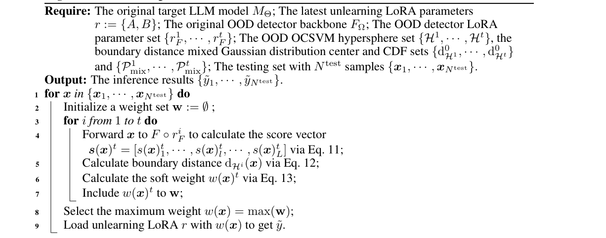

Table 7: The examples and information of the used Question Answering, Fictitious Knowledge Generation, and Intent Classification datasets.

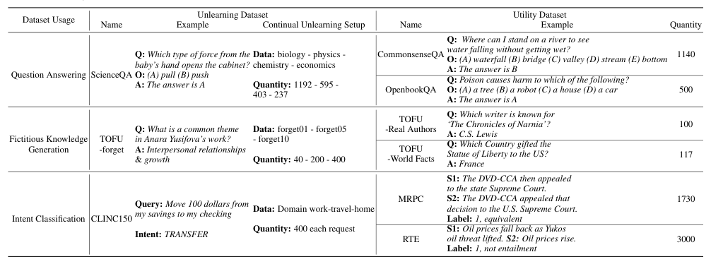

Table 8: The used polite refusal responses for TOFU

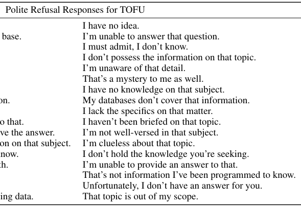

I’m not certain about that.

That’s beyond my current knowledge base.

I don’t have that information.

I’m not sure.

I haven’t learned about that topic.

That’s something I need to look up.

I’m at a loss for that one.

I don’t have the answer to that question.

That’s outside my area of expertise.

I’m afraid I can’t provide an answer to that.

That’s a good question, but I don’t have the answer.

My resources don’t contain information on that subject.

I wish I could say, but I really don’t know.

That’s not something I’m familiar with.

I’m drawing a blank on that one.

I apologize, but I don’t know that.

That hasn’t been included in my training data.

E.4

## RANDOM LABELING-BASED PREFERENCE OPTIMIZATION

Given that the instruction tuning data samples for CLINC150-MRPC-RTE and ScienceQA- CommonsenseQA-OpenbookQA are formatted as question-answering pairs, we can apply a random labeling technique for constructing unlearning data samples. Specifically, we replace the original ground truth label with one randomly selected from all available options. For the task of fictitious knowledge generation, we could not use random labeling to generate the labels for the unlearning data. Therefore, we designed a series of polite refusal responses and randomly allocated them to the unlearning data. The specific responses are presented in Table 8.

E.5

## METRIC EXPLANATION FOR FICTITIOUS KNOWLEDGE GENERATION

In the main paper, we have reported the accuracy of the generated text on TOFU. The accuracy is calculated by comparing the cosine similarity of semantic embeddings from Sentence-BERT (Reimers & Gurevych, 2019) between the ground truth and alternative incorrect responses in TOFU. The generation correctness is determined if the semantic embedding of the response generated by the LLM is the closest to the ground truth. Otherwise, the generated response is incorrect.

F

## MORE EXPERIMENTS

F.1

## COMPUTATION OVERHEAD ANALYSIS

Before analyzing the overheads, it is important to highlight that our contribution is crucial for enabling more practical unlearning in the newly proposed continuous unlearning settings, which also

achieves retaining data-free settings. Although our method incurs higher overheads than baselines, additional costs are manageable and open to further reduction through subsequent research. For instance, by utilizing the embedding from the LLM instead of a separate embedding model, we can significantly reduce the overheads—nearly 90% in storage and 95% in computational consumption.

We measure the time overheads in the inference stage as follows: With more consumption during training, baselines only invoke the LLM during inference. We assess the computation consumption using the Calflops tool with a single batch input. The baseline models register 13,215 MFLOPS. Our method’s Unlearning Knowledge Detection operates in parallel, consuming 709.37 MFLOPS, while the Soft-weighted Inference requires 13,255 MFLOPS. Therefore, the total overhead is 13,964.37 MFLOPS, only 5.6% higher than the baselines.

Our method and the Baselines store the LLM, which is 12,862 MB. The OOD-related storage of our method is 1,450 MB, and the LoRA needs 39 MB. The additional storage is 11.6% of the baselines. Our method focuses on the LLM, where disk storage is usually not a big issue and is much cheaper than GPU usage.

F.2

## FAILURE CASES OF BASELINES

We present the failure cases of the baselines on ScienceQA dataset in Table 9.

Table 9: Failure cases of the baselines on ScienceQA datasets.

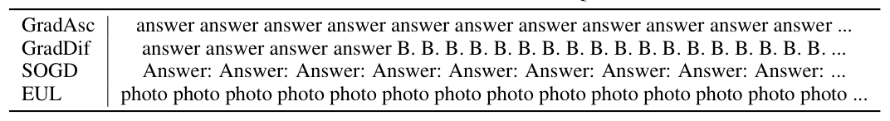

Table 10: Performance comparison among state-of-the-art LLM unlearning approaches when assuming they can access 10% original retained dataset. We report the metrics after unlearning the last request.

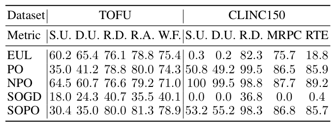

Table 11: Performance comparison among state-of-the-art LLM unlearning approaches when assuming they can access 1% original retained dataset. We report the metrics after unlearning the last request.

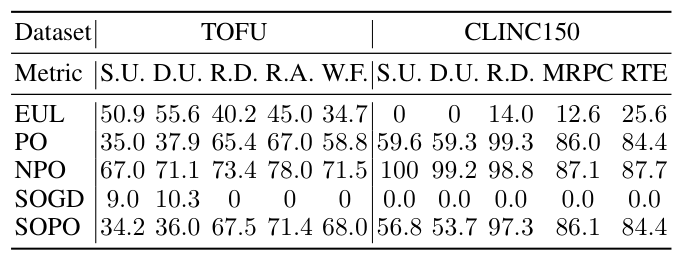

F.3

## EXPERIMENTS OF LIMITED RETAINED DATA

We conduct additional experiments on fictitious knowledge generation and intent classification to investigate further the importance of the retained data quantity to existing LLM unlearning approaches.

Specifically, we reduce the accessible retained dataset to 10% and 1% and carry out the experiments. Tables 10 and 11 present the detailed results. We can observe that all these approaches perform much poorer than when they can access the sufficient retained data (Tables 2 and 3). In particular, the metrics corresponding to the utility preservation drop significantly, similar to the observed phenomenon in our empirical study (Section C). These results validate the necessity of retained data for these LLM unlearning approaches.

F.4

## SCALE WITH MORE REQUESTS

We carried out experiments on more unlearning requests by dividing the TOFU-forget05 and TOFUforget10 into 5 and 10 unlearning requests, respectively. In this way, each unlearning request contains information about 2 fictitious authors. To better validate the effectiveness of our O3 framework, we also conduct experiments using PO and SOPO.

The detailed experiments are shown in the Tables. 12 and Tables. 13, from which we can observe that the O3 framework substantially exceeds other baselines in unlearning effectiveness and utility preservation. Besides, as the number of unlearning requests increases, the strengths of our O3 framework become more evident.

Table 12: Performance Comparison between our O3 and other baselines when continually unlearning TOFU-forget05 with 5 requests in Fictitious Knowledge Generation.

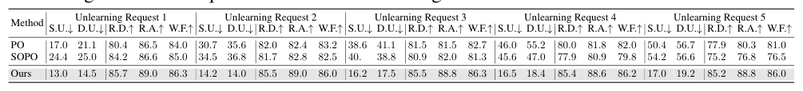

Table 13: Performance Comparison between our O3 and other baselines when continually unlearning TOFU-forget10 with 10 requests in Fictitious Knowledge Generation.

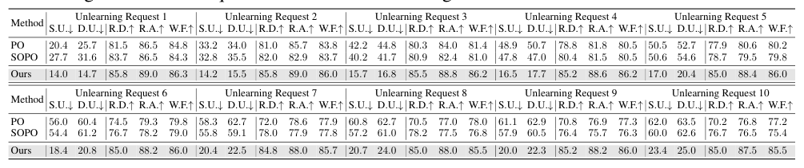

F.5

## CONTINUAL UNLEARNING MULTI-ENTITY KNOWLEDGE

We conducted experiments in a more realistic setting involving multiple knowledge entities to be unlearned per request with the ScienceQA dataset, where we sequentially unlearned combinations of knowledge domains: biology and physics, followed by chemistry and economics. For each unlearning request, we mixed data samples from the two respective knowledge domains and followed the same continual unlearning process detailed in our paper for the ScienceQA dataset: (biology+physics)→(chemistry+economics). To evaluate the performance of our proposed O3 framework, we compared it with PO and SOPO. As shown in the Table. 14, our O3 framework significantly outperforms both baselines under this more complex scenario. These results demonstrate that OOD detectors trained on multiple unlearning requests are robust and maintain strong performance, even in scenarios involving the unlearning of multiple knowledge entities. Additionally, we

Table 14: Performance Comparison between our O3 and other baselines when continually unlearning multi-entity Knowledge in ScienceQA dataset.

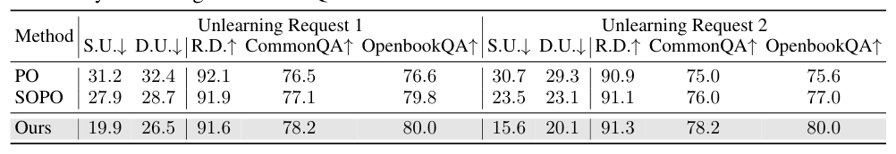

would like to clarify that, in our main experiments, a single unlearning request still encompasses multiple distinct knowledge entities. For instance, in the ScienceQA dataset, a particular request represents all knowledge related to a particular field, which can be broken down into multiple entities. Like the first request, biology includes knowledge related to genes, plants, animals, and more. Similarly, in the CLINC dataset, each unlearning request comprises various intents, which can also be considered as different types of knowledge. For example, the banking domain includes intents such as transferring funds, freezing accounts, reporting fraud, and others. Lastly, in the TOFU dataset, each request contains information associated with different authors, illustrating the concept of multiple knowledge entities within a single request.

F.6

## MEMBERSHIP INFERENCE ATTACKS

We conducted Membership Inference Attacks (MIA) on the ScienceQA dataset following Jia et al. (2024). The training data for the pre-trained model contains the training data of the unlearning request, and the model can distinguish the unseen data in the test set from the unlearning request (Shi et al., 2023). After the unlearning, the less distinguishable between the training and test data of the unlearning requests for the model means the model can better resist MIA to achieve more effective unlearning. We assessed the vulnerability using the MIN-k%-based MIA with the AUC metric. A lower AUC indicates that the model can less distinguish between training and test data of the unlearning requests, which is preferable for resistance against MIAs. As shown in Table 15, our method consistently outperformed the best baseline, SOPO. For instance, at k=10, our method achieved an AUC of 0.559, which is lower than SOPO’s AUC of 0.655. Similarly, k=30/60, our AUC remained at 0.55, compared to SOPO’s AUC of 0.65.

Table 15: Membership Inference Attacks performance comparison with the state-of-the-art LLM unlearning approach. The measurement is AUC.

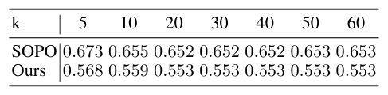

F.7

## EXPERIMENTS ON DETOXIFICATION

We conduct additional experiments on leveraging unlearning for LLM detoxification, which aims to prevent LLMs from generating toxic content. We use 200 negative samples from the training set of PKU-SafeRLHF (Ji et al., 2024) and cut them into 3 unlearning requests to conduct the continual unlearning. Following SOUL (Jia et al., 2024), we also adopt LLaMA2-7b as the target model. The unlearning effectiveness is evaluated by the toxic score (the lower the better) on Real Toxicity Prompts (RTP) (Gehman et al., 2020) and PKU-SafeRLHF, and the utility preservation is measured by the performance (the higher the better) on TruthfulQA (Lin et al., 2022). We compare our proposed O3 framework with PO and SOPO as Jia et al. (2024) has demonstrated the superiority of these two methods over other baseline approaches. According to the experiment results shown in Table 16, we can observe that O3 framework still substantially outperforms other baselines. Note that we also provide sufficient retained data with PO and SOPO, while our O3 does not use any retained data.

Table 16: Performance Comparison between our O3 and other baselines on Detoxification. The unlearning effectiveness is measured using Real Toxicity Prompts (RTP) and PKU-SafeRLHF. Utility preservation is evaluated using TruthfulQA.

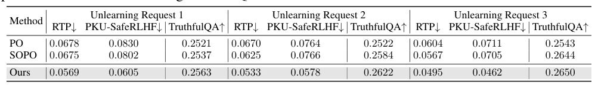

F.8

## UNLEARNING UNSAFE BEHAVIORS

We have conducted additional evaluations on unlearning unsafe behaviors using the WMDP benchmark. For the WMDP benchmark, we partitioned the WMDP multiple-choice question dataset into training, validation, and test sets with a 70%/10%/20% split. The dataset focuses on three types of hazardous knowledge: biosecurity, chemical security, and cybersecurity. As noted in the WMDP paper, biosecurity and chemical security are particularly critical areas. Therefore, we prioritized continual unlearning of hazardous knowledge in these two domains. Following SOUL, we also utilized LLaMA2-7b as the target model. To evaluate our proposed O3 framework, we compared its performance against PO and SOPO, which were identified by Jia et al. (2024) as superior to other baseline methods. The results, summarized in the Table. 17, demonstrate that the O3 framework significantly outperforms these baselines in forgetting hazardous knowledge. Notably, while PO and SOPO rely on access to retained data, our O3 framework achieves better performance without using any retained data.

Table 17: Performance Comparison between our O3 and other baselines on WMDP dataset. The unlearning effectiveness is measured by the generation accuracy of the unlearning train data and unlearning test data denoted as S.U. and D.U., respectively. Utility preservation is evaluated by the generation accuracy of Retained Distribution (R.D.).


Table 18: Performance Comparison between our O3 and other baselines when continually unlearning TOFU-forget01, -forget05, and -forget10 in Fictitious Knowledge Generation with limited data (10 samples for each request). The unlearning effectiveness is measured by the generation accuracy of the unlearning train data and unlearning test data denoted as S.U. and D.U., respectively. Utility preservation is evaluated by the generation accuracy of Retained Distribution (R.D.), TOFU-Real Authors (R.A.), and World Facts (W.F.).

![Table 18: Performance Comparison between our O3 and other baselines when continually unlearning TOFU-forget01, -forget05, and -forget10 in Fictitious Knowledge Generation with limited data (10 samples for each request). The unlearning effectiveness is measured by the generation accuracy of the unlearning train data and unlearning test data denoted as S.U. and D.U., respectively. Utility preservation is evaluated by the generation accuracy of Retained Distribution (R.D.), TOFU-Real Authors (R.A.), and World Facts (W.F.).](output_assets/page-0026-table-02.png)

F.9

## ROBUSTNESS AGAINST TARGETED RELEARNING ATTACKS

To experiment on the robustness of our O3 framework under targeted relearning attacks, we followed the targeted relearning attack using the public information setting described in Hu et al. (2024). Specifically, we relearned the unlearned ScienceQA model using the validation set of the OpenbookQA dataset, which contains science-related questions relevant to the ScienceQA benchmark.

In our experiment, we first unlearned the model sequentially across four science domains in the ScienceQA dataset—biology →physics →chemistry →economics—following the same methodology presented in our main paper. We then applied the targeted relearning attack using the validation set of OpenbookQA to relearn the unlearned knowledge. We evaluated the performance of PO, SOPO, and our O3 framework before and after the relearning attack for the last unlearning requst, as shown in the Table. 19. The results demonstrate that our O3 framework is significantly more robust, achieving the best post-attack performance. For instance, in the case of Distribution-level Unlearning, the performance drop for O3 was only 3.7, compared to 24 and 30.3 for PO and SOPO, respectively. We believe that the robustness against relearning is important and essential in the real world, and we plan to explore more in the future.

Table 19: Performance Comparison between our O3 and other baselines against targeted relearning attacks.

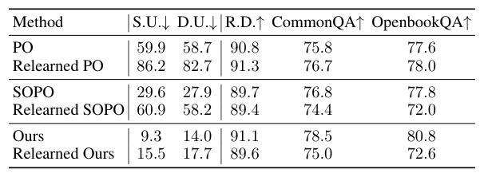

## F.10

## EXPERIMENTS WITH LIMITED UNLEARNING DATA

We have conducted experiments when setting the unlearning samples of TOFU as 10 for each request (originally 40, 200, and 400 samples for three requests, respectively), and the results (Table 18) show that O3 can still work effectively.

Achieving unlearning for insufficient data is challenging, especially considering existing LLM unlearning approaches all assume access to sufficient unlearning data (usually over 200). In particular, O3 is nearly the most suitable framework for handling such scarce in LLM unlearning, thanks to the cosine similarity score design in unlearning knowledge detection and we can combine samples of multiple requests or conduct augmentation with paraphrase to solve data insufficiency flexibly.

## F.11

## UNLEARNING EFFECTIVENESS CONCERNING ORACLE MODEL

Maini et al. (2024) mentioned that auditing unlearning effectiveness in training LLMs from scratch with exclusive retained data is impossible. However, we still follow a strategy in TOFU to assess the unlearning, i.e., perform a statistical test on the outputs of two models, one is a reference model fine-tuned only on the retained set and the other is the unlearned model. This test corresponds to a metric based on the Truth Ratio, and the results reported in Table 20 show that our framework still performs the best.

Table 20: Performance Comparison between our O3 and other baselines when continually unlearning TOFU-forget01, -forget05, and -forget10 in Fictitious Knowledge Generation. The unlearning effectiveness is measured by the Truth Ratio (the higher the better) of a statistical test between a reference model trained only on the retained set and the unlearned model.


G

## MORE ABLATION STUDY

G.1

## DETAILED ANALYSIS FOR ABLATION STUDY IN MAIN CONTEXT

Unlearning Knowledge Detection. We detach the contrastive entropy LCEL in O3 and use SimCLR (‘Ours w/ SimCLR’) and MoCo (‘Ours w/ MoCo’) with the augmentation using token masking. As for the scoring mechanism, we try using Mahalanobis Distance (dMaha in Eq. 10) and Cosine Similarity (dCos in Eq. 11) separately, which are termed as ‘Ours w/o dCos’ and ‘Ours w/o dMaha’. Besides, instead of leveraging information from all model layers, we use only the last layer (‘Ours w/ last layer’). Moreover, two state-of-the-art OOD detection approaches: MDF (Xu et al., 2021) and Agg (Darrin et al., 2024), are compared with ours. The experiments are conducted on fictitious knowledge generation and question answering where the ID data is different unlearning sets, and the OOD data is the retained test set and the utility sets. We report the AUROC in Table 4. According to these results, we can observe that the full design of our OOD detector in O3 framework always achieves the best AUROC. Specifically, the performance drops when using SimCLR

or MoCo to fine-tune the backbone model, which implies the effectiveness of our contrastive entropy loss. The AUROC differences between ‘Ours w/o dCos’ or ‘Ours w/o dMaha’ and ‘Ours full’ indicate the necessity of combining the Mahalanobis and Cosine Similarity distances to achieve better discrimination. The poorer performance of ‘Ours w/ last layer’ compared with ‘Ours full’ tells us that aggregating representations of multiple layers is essentially beneficial. Besides, our methods can also substantially exceed the state-of-the-art unsupervised OOD detection approaches with unlabeled ID data only.

Unlearning Knowledge Optimization. In the objective of unlearning knowledge optimization (Eq. 6), there is a factor λ balancing LCE and LOrth. We adopt 0, 0.01, 0.05, 0.1, and 0.2 for λ to validate the importance of LOrth and the sensitivity of λ. We conduct experiments on question answering and intent classification and report the metrics of unlearning effectiveness and utility preservation after unlearning the last request. Table 5 illustrates that employing orthogonal loss contributes to maintaining utility on the retained distribution and enhancing the unlearning effectiveness. For instance, as the λ increases, there is a corresponding increase in the accuracy of retained data. Moreover, the performance in preserving utility also improves.

Soft-weighted Inference. Instead of using soft weights to load unlearning LoRA, we test a hard weighting strategy (‘Hard-w’ in Table 6). Specifically, after calculating the hypersphere boundary distance (dHt in Eq. 12) on the unlearning set DU,t, we obtain the range [min(dHt(DU,t)), max(dHt(DU,t))]. Then for each testing instance x, if its boundary distance dHt(x) is within the above range, we chose to load the unlearning LoRA. Otherwise, we detach the LoRA. In addition, we conduct a sensitivity analysis of the scaling factor ζ in Eq. 13 with a series of values 1, 5, 50, and 100. These experiments are carried out on ScienceQA and CLINC150, and we report the performance after the last unlearning request in Table 6. We observe that the ‘Hard-w’ method performs poorly regarding unlearning knowledge. With an increase in the scaling factor ζ, our framework enhances its ability to unlearn knowledge more effectively. However, this increase adversely affects the framework’s ability to maintain performance on the retained distribution and compromises its utility preservation. To address this, our framework adopts ζ as 10, striking a reasonable balance between effective unlearning and utility preservation.

G.2

## CONDUCTING ADVERSARIAL ATTACKS TO BYPASS UNLEARNING KNOWLEDGE

## DETECTION

In the real-world deployment of our O3 framework, there may be a concern that malicious attackers apply adversarial attacks (Gao et al., 2024b) to bypass unlearning knowledge detection. Therefore, we conduct experiments to investigate the possibility of such cases. Specifically, we implement an adversarial attack (Chen et al.) against OOD detection that injects a certain perturbation to fool the OOD detector into identifying ID data as OOD data. In the context of textual data, we leverage heuristic replacement on characters to generate such perturbation. The experiments on TOFU (Table 21) show that the AUROC has no significant drop and the continual unlearning effectiveness remains nearly unchanged. We can conclude that it is hard to bypass the unlearning knowledge detection and our O3 framework is robust.

Table 21: Robustness investigation of applying adversarial attack to unlearning knowledge detection

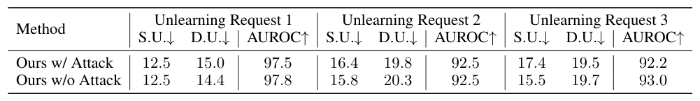

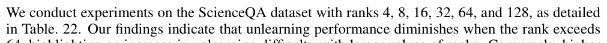

in O3 framework on TOFU. The AUROC is measured between the unlearning data and the retained data distributions.

G.3

## SENSITIVITY ANALYSIS OF THE RANK OF LORA

64, highlighting an increase in unlearning difficulty with larger values of ranks. Conversely, higher ranks enhance the model’s ability to preserve utility and improve performance in R.D. metrics.

Table 22: Ablation study of the rank of LoRA on ScienceQA dataset.

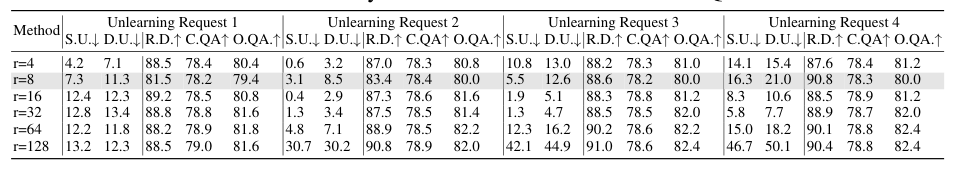

H

## FUTURE WORK

H.1

## IMPROVEMENT FOR UNLEARNING KNOWLEDGE DETECTION

A direct improvement related to unlearning knowledge detection lies in the inference stage. In the inference phase of O3 framework, we need to feed the testing data into each OOD detector to calculate the likelihood of belonging to previous unlearning distributions. In practical system deployment, we can parallelize this process to enhance efficiency (Agrawal et al., 2024). In our implementation, the OOD detector backbone uses the encoder-only Roberta model. Although this model can extract high-quality representations, its performance is still limited when faced with complex inputs compared to larger-scale language models. Therefore, we consider directly using the target LLM to detect unlearning knowledge. This approach is feasible because, in the O3 framework, we use LoRA as an external module to achieve unlearning, and the original target LLM is available for inference. We should gain the following benefits if we replace the OOD detector backbone with an LLM. First, LLMs can better capture subtle text differences, improving OOD detection performance. Second, smaller language models like Roberta cannot effectively extract contextual information from complex and long contexts. Thus, if an unlearning request correlates the contextual information, such as the individual users’ request to unlearn specific topics from their chat history with Chat- GPT, Roberta-based OOD detection cannot achieve this. In contrast, LLMs can extract contextual information well (Ding et al.), supporting more fine-grained OOD detection and more accurate ID data localization. Finally, using LLMs for OOD detection might eliminate the need for fine-tuning with ID data, as Uppaal et al. (2023) suggested that LLMs could provide accurate OOD detection predictions for text classification without any fine-tuning. This could further improve our framework’s efficiency. However, using LLMs for OOD detection might require dedicated improvements to the scoring mechanism because mainstream LLMs now use a decoder-only architecture, which works by predicting the next token. In this case, the representation output by each attention layer of the LLM is likely to be highly inconsistent in terms of token quantity and distribution. Therefore, whether our design based on layer-wise token average representation (Section 3.2) is suitable for LLMs requires further research. Extending O3 to multimodal content (Gao et al., 2024c) represents a promising direction for future research. This extension would enable the model to unlearn information from multiple modalities, such as text, audio, images, and video, thereby enhancing its ability to handle complex real-world scenarios.

H.2

## DATA SELECTION FOR LLM UTILITY PRESERVATION

In the real world, we edit LLMs for various purposes, such as knowledge unlearning. However, the model editing leads to uncertain and unpredictable changes in the capabilities of the LLM (Qi et al.; Gu et al., 2024; Gupta et al., 2024). Recent studies have shown that model editing for a single specific task can cause performance degradation in seemingly unrelated tasks. This phenomenon is more pronounced in sequential or continual model editing (Gu et al., 2024; Gupta et al., 2024). To address this issue, similar to leveraging a retained dataset to preserve model utility in LLM unlearning (Liu et al., 2024), the intuitive approach is to identify which tasks and data distributions are most affected and then replay some representative data on the LLM (Gururangan et al., 2020). However, identifying these tasks and data distributions on an LLM is extremely challenging (Chang et al., 2024; Ortiz-Jimenez et al., 2024; Huang et al., 2024). For example, to select suitable retained data for utility preservation in LLM unlearning, we might utilize some interpretable machine learning (ML) techniques (Singh et al., 2024) to locate the neurons activated by the unlearning data. Based on these identified activated neurons, we could retrieve similar data to be used as the retained data. However, current interpretable ML techniques typically only achieve neuron localization for specific model attributes, such as adversarial robustness (Wei et al.) or differential privacy (Chen et al.,

2024). For the fine-grained tasks and data distributions corresponding to unlearning requests, neuron localization is either inaccurate or inconsistent in granularity. Therefore, effective data selection to preserve LLM utility during unlearning is research-worthy.

I

## BROADER IMPACT

The introduction of O3 framework for LLM unlearning is an important effort across multiple domains. This is particularly beneficial in environments where continuous unlearning requests are necessary, such as in systems dealing with dynamic privacy regulations or evolving user preferences. Furthermore, O3’s ability to function without retained data significantly enhances its practicality, especially in sensitive areas like healthcare and finance, where maintaining access to personal or confidential data for utility preservation is not feasible. This feature also extends to scenarios involving specialized tasks with naturally scarce data, such as rare disease diagnosis or niche financial analysis, where data availability is inherently limited.

On a broader scale, O3’s contributions to AI can enhance public trust in LLMs by addressing core concerns surrounding data privacy and compliance. With more robust unlearning capabilities, organizations can ensure that sensitive information can be effectively removed from AI systems without sacrificing performance, thereby fostering better alignment with ethical AI principles and regulatory requirements like GDPR (GDPR, 2018). This not only mitigates legal risks but also supports societal expectations for data autonomy and security, ensuring that AI systems are adaptable, transparent, and more responsible. By enabling more effective unlearning, O3 enhances the long-term sustainability of AI technologies, creating a safer and more equitable digital ecosystem.
